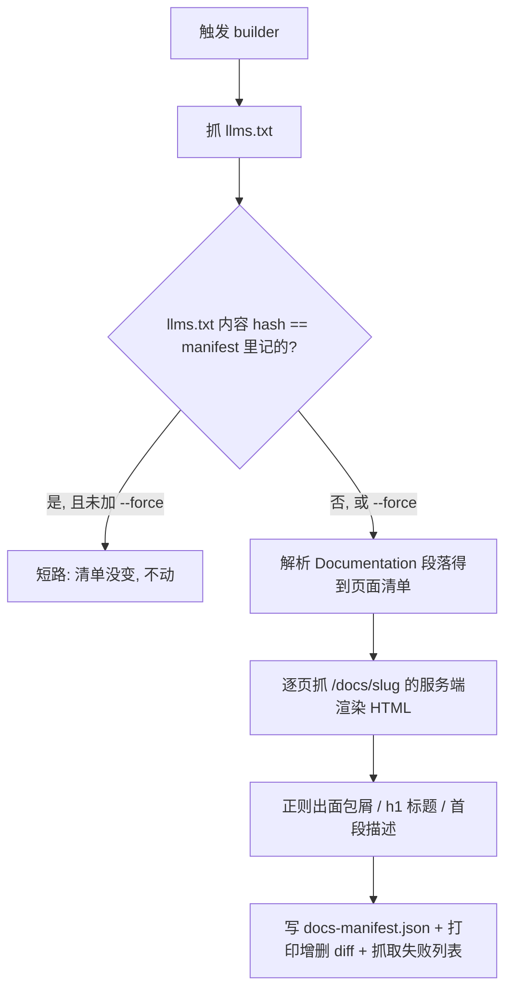

# Antigravity 文档索引构建器 Skill

这个 Skill 是 `antigravity-docs` 的**配套维护工具**。它做一件事:重新生成 `antigravity-docs` 依赖的那份 `docs-manifest.json`。你手动触发它(比如打 `/antigravity-docs-index-builder`),它就去 Antigravity 官网把最新的文档清单抽出来、写好。`antigravity-docs` 自己永远不会调它。

---

## 1. 它为什么必须存在(以及为什么这一版和上一版不一样)

Claude Code 和 Codex 的文档页都有一个原始 `.md` 孪生页,直接抓就行。Antigravity 以前不一样:`antigravity.google/docs/*` 是**纯前端渲染的 SPA**,直接抓一个文档页只会拿到一个空壳。所以最早那版构建器,是从 app 的 JS bundle(`main-<hash>.js`)里反解出一个 `DOCS_STRUCTURE` 数组当页面清单,正文另外去抓一个 `/assets/docs/<path>/<filename>.md` 的"孪生"地址。

2026-07 前后 Antigravity 把官网整个重写成了**服务端渲染的 Astro 应用**:现在直接抓 `/docs/<slug>` 就能拿到带正文的完整 HTML;而旧版依赖的 JS bundle 和 `.md` 孪生地址两条路都 404 了。所以这一版构建器换了策略:

1. 抓 **`llms.txt`**——它在 `## Documentation` 下按 `### <产品名>` 分组,列出 `- [标题](https://antigravity.google/docs/<slug>): 描述`。这现在就是权威的页面清单,不再需要 bundle。它给的描述是套话("Learn about X"),只当兜底用。
2. **直接抓每一个页面**,从服务端渲染好的 HTML 里正则出三样东西:
   - 面包屑导航(`docs-main-content` 里的 nav)——比 `llms.txt` 那个扁平的 section 更细,比如 `Antigravity 2.0 / Customizations / Skills`
   - `<h1>` 标题
   - 正文第一段当描述,也就是第一个 `<h1>` 之后第一个够长(≥ 20 字符)的 `
`,截到 280 字符
3. `content_url` 直接记**页面本身的 URL**(`https://antigravity.google/docs/<slug>`)——因为现在这个地址本身就能直接抓到正文了(WebFetch 能正常把这页 SSR 出来的 HTML 转成 markdown),`antigravity-docs` 不再需要单独一个 asset 地址。

---

## 2. 怎么用

打 `/antigravity-docs-index-builder` 就行。它会自己跑 `scripts/build_manifest.py`:

- 先抓 `llms.txt`;
- **如果它的内容 hash 和 manifest 里记的一样,就直接短路**——页面清单没变,什么都不做(注意这只能识别"清单变没变",单个页面正文改了但清单没变是察觉不到的,所以偶尔手动 `--force` 一次是合理的);
- 否则解析出页面清单,逐页抓 `/docs/<slug>`(约 77 个请求,带节流),从每页正则出面包屑/标题/描述,写出新 manifest,并打印出"和上一版相比新增/删除了哪些页面",以及哪些页面抓取失败(这些会退化成用 `llms.txt` 的标题/分组/套话描述)。

想强制重建(哪怕 `llms.txt` 没变),加 `--force`。跑完它会告诉你:页数、增删了哪些 slug。

一句话:你只要偶尔想刷新 Antigravity 文档索引,触发这个 Skill 就够了。

---

## 3. 一个关键陷阱:抓 HTML 结构时不能用 WebFetch

这版构建器要精确匹配 HTML 的原始结构(`breadcrumb-list` 这个 class、`<h1>`、以及它后面的 `
`)才能正则出面包屑和描述,所以必须走**原始字节抓取**(`curl` / Python `urllib`),不能走 WebFetch 这类"把 HTML 转成 markdown"的抓取器——转换过程会把这些 class 属性和精确的 DOM 结构都抹掉,正则就没法定位了。这就是为什么这个 Skill 的 `allowed-tools` 是 `Bash` 而不是 `WebFetch`。

`antigravity-docs` 自己倒是反过来:它现在直接用 WebFetch 抓 `content_url`(也就是文档页本身),因为它只要转换后的可读正文,不需要精确 DOM。

---

## 4. manifest 长什么样,为什么这么设计

生成出来的 `docs-manifest.json` 分两块。

`_meta` 记录溯源信息:生成日期、`llms.txt` 的地址和 sha256、页数、内容 URL 的模板。这里的版本标记从"bundle 文件名"换成了 **`llms.txt` 的内容 hash**——旧版靠 bundle 文件名自带内容 hash 来零成本判断"文档变没变",现在 bundle 没了,退而求其次用 `llms.txt` 整体内容的 hash 做同样的短路判断,原理一样但粒度粗一点(只能感知清单层面的变化)。

`pages` 是 77 条文档记录,每条 `{section, slug, title, description, content_url}`。`section` 现在优先取抓页面时解析出的面包屑(更细),解析失败才退回 `llms.txt` 的分组名;`title` 和 `description` 同理优先取页面正文,失败才退回 `llms.txt`;`content_url` 就是文档页本身的地址,`antigravity-docs` 直接 WebFetch 它。顺序保留了 `llms.txt` 里的原始出现顺序,也就是官方的文档阅读顺序。

---

## 5. 出错了怎么办,以及几条纪律

脚本被刻意写成"宁可报错也不写出一份坏 manifest"。页面清单这一层解析失败会大声退出:

- **找不到 `## Documentation` 段落 / 一条页面都没解析出来**:说明 `llms.txt` 的格式变了。`curl -s https://antigravity.google/llms.txt` 看一眼新格式,改 `parse_llms_doc_pages` 的正则。

单个页面抓取失败**不是**致命错误——脚本会记下来、那一页退化用 `llms.txt` 的字段兜底,继续跑完。但如果**大部分或全部**页面都抓不到面包屑/描述(不只是零星几个超时),说明官网的 HTML 结构变了:`curl -s --compressed <某个 /docs/slug 地址> -o page.html`,照着 `docs-main-content` 附近现在的结构,把 `BREADCRUMB_RE` / `H1_RE` / `PARA_RE` 重新对一遍。注意 `--compressed` 不是可选的:这台服务器就算你叫它别压也照压,裸 `curl` 拿到的是 gzip 字节,看起来像一堆乱码。

从 0.2.2 起你不用自己去发现这件事:每次跑完都会打印一个 **Scrape coverage** 区块,逐字段报 `n/total scraped`;某个字段在「能正常抓取的页面」里退化超过一半时,会额外打印一个框起来的警告,直接点名该去检查哪条正则。**带着这个警告的构建不算成功**,别把它当成正常结果往下传。

这一条是有来历的:0.2.1 里描述那条正则找的 class 已经不存在了,81 页全部退化成 `Learn about X.`,而当时的脚本只统计网络异常,所以整个构建从头到尾报告成功,这个问题在 2026-07-25 到 07-30 之间一直没被发现。Scrape coverage 就是为了让它不可能再无声发生。

改完重跑,并在这个 Skill 的 `CHANGELOG.md` 里记一笔。

几条纪律:**永远不要手改 `docs-manifest.json`**——它是生成物,手改的东西下次一跑就被覆盖,要修就修构建器。**抓 HTML 结构时只能原始抓取**,理由见第 3 节。**大面积抓取失败是信号,不是噪音**——一两页失败正常,大部分失败说明结构变了,得先去看一眼再信这份 manifest。**别扩张职责**:这个构建器只负责写 manifest,不抓、不缓存完整正文——那是 `antigravity-docs` 在回答问题时才做的事。
