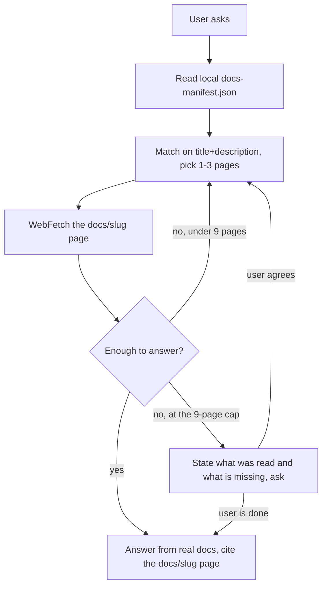

# Antigravity Docs Lookup Skill

This skill makes the agent read the current official Google Antigravity documentation instead
of relying on what it memorized at training time. Antigravity is a young product — the IDE,
the CLI, the SDK, skills, MCP, and the permission model all move fast — so answering from
memory goes wrong easily. What this skill does is turn "look it up first, then answer" into a
fixed procedure.

It shares its goal with `claude-code-docs` and `codex-docs`, but **the mechanism it uses to
get at the docs is different**. That difference is the key to understanding it, and section 3
spells it out.

---

## 1. What problem it solves

Say you are writing an explanation of Antigravity's asynchronous subagents, or you hit an error
configuring the CLI or MCP, or you want to know what a particular agent setting means. Those
answers live in the official docs, and the docs change. Answer from impression and the command,
field, or slug you produce may already have been renamed.

The skill covers Antigravity's full docs scope: Antigravity 2.0 (the agentic IDE), the
Antigravity CLI, the SDK, and agents/subagents, models, skills, rules/workflows, hooks, MCP,
browser use, settings, enterprise, migration, and the FAQ.

---

## 2. How to use it

Most of the time you do nothing. When your task depends on official Antigravity information,
the skill triggers and runs the lookup itself. You can pass a specific topic as an argument
(`subagents`, `cli install`), or pass nothing and let it infer the topic from the conversation.

Its answers land on real doc content, and it cites the doc title and page URL when stating
anything non-obvious so you can check. What you get back is not a paraphrase blended with stale
knowledge — it is what the current official docs say.

In one line: if what you are doing depends on current official Antigravity information, this
skill is enough.

---

## 3. The key difference from the other two docs skills

Codex and Claude Code publish `.md` twins at their page URLs, so those skills fetch a doc URL
directly and get the body. Antigravity used not to allow that — its doc pages were a
client-rendered SPA, so fetching the page URL returned an empty shell and the body had to come
from a separate asset URL. **Around July 2026 Antigravity rebuilt the site as server-rendered**,
so `content_url` is now the doc page itself (`https://antigravity.google/docs/<slug>`) and a
plain WebFetch returns the body — converging with how the other two skills work.

So why keep a local manifest instead of just reading `llms.txt` live? Because `llms.txt`'s own
per-page descriptions are boilerplate ("Learn about X") and cannot support triage. The
companion `antigravity-docs-index-builder` skill is meant to pre-scrape each page once for a
genuinely informative lead-paragraph description and a finer breadcrumb grouping (for example
`Antigravity 2.0 / Customizations / Skills`) and write those into the manifest — which is what
makes "match on title + description" work at all.

- **The index is a local file**, `references/docs-manifest.json`, generated by the companion
  `antigravity-docs-index-builder` skill. This skill `Read`s it — it **does not fetch
  `llms.txt` and does not crawl the site**.
- **The content is the page itself** (`content_url` in each manifest entry, i.e.
  `https://antigravity.google/docs/<slug>`). WebFetch it directly.

So the flow is: **read the local manifest → pick pages → WebFetch their `content_url`**.

> **History worth knowing:** between 2026-07-25 and 2026-07-30 this was true in design only. The
> builder's description regex looked for a class that no longer existed in the page HTML and fell
> back silently, so all 81 descriptions were `Learn about X.` boilerplate and triage ran on title
> plus breadcrumb alone. Fixed in `antigravity-docs-index-builder` 0.2.2 and regenerated on
> 2026-07-31: coverage is now 81/81 with 0 boilerplate descriptions. `references/mechanism.md`
> has the measured before/after.

---

## 4. How the procedure is designed

The core is a small-batch, evaluate, loop process.

**Step one, read the manifest.** It `Read`s the local JSON, which holds `_meta` (generation
date, hash of the source `llms.txt`) and `pages`, each `{section, slug, title, description,
content_url}`. If the file is missing, it tells the user to run
`/antigravity-docs-index-builder` first rather than guessing URLs.

**Step two, pick pages.** It matches the user's question against each entry's `title +
description`, not the slug alone. One to three pages per batch; a specific feature question
maps to one page; only a cross-concept question justifies several. If nothing in the manifest
matches, it says so — the manifest is the complete list of doc pages, so a miss means either
the page does not exist or the manifest is stale (worth suggesting a rebuild) — and it never
invents a `content_url`.

**Step three, fetch the batch.** For each selected page, WebFetch its `content_url` (the
`https://antigravity.google/docs/<slug>` address), with a prompt phrased as a question that
captures the user's real need rather than a generic "summarize this page".

**Step four, evaluate, then answer or loop.** After a batch, judge whether it is enough. Enough
— answer with citations (`content_url`, the same address a person would open). Not enough — go
back to step two for another one to three pages. The loop runs until it can answer, capped at
nine pages. At nine and still short, it stops, states honestly what it read and what is
missing, and asks whether to continue — neither blowing past the cap quietly nor filling the
gap with guesses.



---

## 5. The reasoning behind the hard rules

**Read the manifest, do not crawl.** The page list and the content URLs come only from
`references/docs-manifest.json`. Do not guess a `/docs/<slug>` address that is not in it —
slugs are not always the obvious guess (CLI pages live under `cli/...`, IDE pages under
`ide/...`). This rule is where the skill's reliability comes from.

**Small batches, nine-page cap.** Fetch one to three, judge, fetch more only if needed, and ask
the user at nine. Same reasoning as the other two docs skills: grabbing too much dilutes the
signal, one batch is often not enough, the loop plus the cap balances them, and asking at the
ceiling hands the "keep digging or stop" judgment back to the user.

**A 404 on a `content_url` means the manifest is stale.** The page was renamed or removed
upstream. The right move is to tell the user to run `/antigravity-docs-index-builder`, not to
guess the new address. This is exactly the value of splitting index and consumption into two
skills: the content layer just uses the map, and repairing a stale one is the builder's job.

**Pass the docs through rather than aggressively blending them with prior knowledge**, because
the user wants current authoritative behavior, not a synthesis laced with outdated assumptions.

---

## 6. Reproducing this by hand (and a gzip trap that will bite you)

If you want to verify from a terminal whether a given `content_url` is reachable and what it
returns, a plain `curl` will most likely mislead you — **bare `curl` returns something that is
not Markdown and does not even look like text, just binary noise**. That has nothing to do with
reachability; two things stack up:

1. **What comes back is HTML, not Markdown.** A `https://antigravity.google/docs/<slug>` URL
   returns server-rendered page source (`<div class="docs-main-content">`, `<script>` tags,
   analytics), not a plain Markdown file. The "Markdown body" you see in this skill's answers
   is what the WebFetch tool **converts** the HTML into; the server offers no ready-made `.md`.
   That is also why section 3 says not to guess `/assets/docs/...` addresses — that path is
   gone, and the HTML-returning page URL is the only thing there is to fetch.
2. **This server gzips unconditionally.** Even with an explicit `Accept-Encoding: identity`
   ("do not compress"), it compresses anyway. `curl` by default neither requests gzip nor
   decompresses it, so bare `curl <url>` hands you raw gzip bytes that the terminal prints as
   garbage — which is exactly the "binary / looks like JS" output you would see.

The correct manual check is two steps:

```bash
# Step 1: confirm the address is alive and the content is the expected HTML
# (note --compressed; without that flag you get garbage)
curl -sI --compressed "https://antigravity.google/docs/rules-workflows"   # is the status 200?
curl -s --compressed "https://antigravity.google/docs/rules-workflows" | head -c 500   # does it look like HTML?

# Step 2: to see it as readable text, opening the URL in a browser is simplest;
# or use the same regex as antigravity-docs-index-builder/scripts/build_manifest.py
# to roughly pull out body paragraphs
curl -s --compressed "https://antigravity.google/docs/rules-workflows" | \
  grep -oE '<div class="caption template-content-paragraph"[^>]*>.*?</div>'
```

`build_manifest.py` in `antigravity-docs-index-builder` has already hit and handled this gzip
trap — its `fetch()` checks whether the response starts with the gzip magic bytes (`\x1f\x8b`)
and, if so, decompresses manually with Python's `gzip` module rather than trusting
`urllib`/`curl` defaults. When verifying by hand, remember `--compressed`; in any other
language or tool, do the gzip step explicitly, or you will wrongly conclude the page is
unfetchable or serving junk.

---

Understanding these six sections is enough to see why the index is a local file, why it does
not read `llms.txt` live, and why refreshing is delegated to a separate builder skill. This
skill and `antigravity-docs-index-builder` are a pair: the builder is responsible for keeping
the doc map fresh and its descriptions informative, and this skill is responsible for giving
reliable answers from that map.
