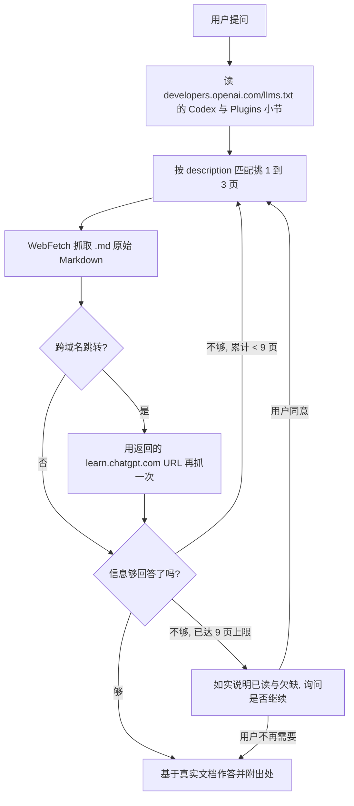

> 这是 [README.md](README.md) 的中文翻译, 只供人阅读。**英文版是权威版本**, 两者不一致时以英文版为准,
> 并把这份翻译改过来。维护是单向的: 改了英文版就回来同步这份, 反过来不成立。

# Codex 文档索引 Skill

这个 Skill 让 agent 在需要了解 OpenAI Codex 时，不再依赖训练时记住的、可能已经过期的知识，而是去读官方文档的最新版本。Codex 的命令、配置项、sandbox、skills、MCP、权限模型都在持续变化，靠记忆回答很容易出错。这个 Skill 的作用就是把「先查官方文档、再回答」这件事固化成一个稳定流程。

---

## 1. 它解决什么问题

假设你要写一段关于 Codex CLI slash 命令的说明，或者你在配置 MCP、sandbox 时遇到了报错，又或者你想知道某个配置字段到底是什么含义。这些问题的答案都在官方文档里，而且官方文档随时会更新。如果直接凭印象回答，你给出的 slug、字段名、命令格式很可能已经被改掉了。

这个 Skill 的定位很单纯：凡是关于 Codex 本身的问题，它都先去官方索引里找到对应页面，抓取当前内容，再基于真实文档作答。它覆盖 Codex CLI（安装、slash 命令、命令行选项、配置、sandbox、认证）、IDE 扩展、Codex app（自动化、worktrees、computer use、Chrome 扩展）、Codex cloud，以及 subagents、skills、MCP、企业版、GitHub/Linear/Slack 集成等概念和场景。

需要区分一个边界：如果问题是关于更广的 OpenAI API 或 OpenAI SDK 本身，而不是 Codex 这个编码 agent，那属于 `developers.openai.com/api` 的范围，不在这个 Skill 里。

---

## 2. 怎么用

大多数时候你什么都不用做。当你手头的任务依赖 Codex 的官方信息时，直接触发这个 Skill，它会自己完成查询。你可以把一个具体话题作为参数传进去（比如 `slash commands` 或 `sandbox`），也可以什么都不传，让它从当前对话里自己推断你要查的主题。

它的输出会落在真实文档内容上，并在陈述不那么显然的事实时附上文档标题和 URL，方便你回去核对。换句话说，你从它这里拿到的不是一段综合了旧知识的复述，而是当前官方文档怎么说，它就怎么传达。

一句话总结前半段：只要你要做的事情依赖 Codex agent 的官方最新信息，参考这个 Skill 就够了。

---

## 3. 底层原理，给维护者看

从这里往下是写给维护这个 Skill 的人看的，讲清楚它到底是怎么被造出来的，为什么这么设计。

整个 Skill 的核心思想是惰性加载（lazy load）。它不把上百页文档塞进 prompt，而是只依赖一个入口，也就是官方维护的索引文件 https://developers.openai.com/llms.txt 。这个索引是一张大约八百四十行的地图，覆盖 OpenAI 的多条产品线，按 `## <产品线> — <主题>` 分组，Codex 落在 `## Codex — ...` 这批小节里，插件开发落在 `## Plugins — ...` 里。每一条长这样：

```
- [Title](https://developers.openai.com/codex/<slug>.md): description
```

注意每个 URL 都以 `.md` 结尾，官方给每一页都准备了一个 Markdown 孪生页，抓下来的是原始 Markdown，不是渲染后的 HTML，这让内容对 agent 更友好。

---

## 3.5. 一次搬迁，和它留下的三个坑

这一节是 2026-07-29 修复时补上的，讲清楚为什么入口 URL 变了。

OpenAI 把 Codex 文档正文整体搬到了 `learn.chatgpt.com/docs/` 这个新域名下，并在旧域名上配了一整套 308 跳转。搬迁本身没问题，但留下了三个必须知道的坑：

第一，**旧的 Codex 专属索引彻底死了**。`https://developers.openai.com/codex/llms.txt` 会被那套 blanket 跳转规则一并改写到 `https://learn.chatgpt.com/docs/llms.txt`，而新站根本没有这个文件，返回 404。`codex/llms-full.txt` 同理。更坑的是，开发者站自己的根索引里至今还挂着指向 `codex/llms.txt` 的链接（第 16 行），照着它走就是死路。新站也没有自己的 `llms.txt`，只有一份不带描述的 `sitemap-index.xml`，没法用来做「按描述分诊」。

第二，**能用的索引是上一级的 `https://developers.openai.com/llms.txt`**。Codex 的整张地图被并进了这个 hub 级索引，格式没变，只是分组从 `## Section` 变成了 `## Codex — <主题>`。实测这里列出的 137 条 Codex 页面里有 132 条可达，剩下 5 条是官方自己没清理的失效条目（比如 `codex/overview.md`、`codex/resources.md`），遇到就换一条，别去手工修 slug。

第三，**抓正文要跳两次**。`WebFetch` 出于安全考虑不会自动跟随跨域名跳转，它会把跳转目标返回给调用方。所以抓一个 `developers.openai.com/codex/<slug>.md` 时，第一次调用拿到的是 `REDIRECT DETECTED`，需要用返回的 `learn.chatgpt.com/docs/<slug>.md` 再调一次。这不是报错，是正常流程，两次算一页。而且新旧 slug 不是简单换域名：`codex/skills.md` 落在 `docs/build-skills.md`，`codex/config-reference.md` 落在 `docs/config-file/config-reference.md`。所以绝对不能自己拼新站 URL，只能让跳转告诉你。

插件开发那批页面是例外，它们在 `https://developers.openai.com/plugins/<path>.md`，直连可达，不跳转。

---

## 4. 工作流程是怎么设计的

Skill 的执行分成几步，而且核心是一个「小批次 + 评估 + 循环」的过程，不是一次性读完就结束。

第一步是读索引。它用 `WebFetch` 抓 `https://developers.openai.com/llms.txt`，要求返回 `## Codex —` 和 `## Plugins —` 这两族小节的原始 Markdown，保留每一条 `- [Title](URL): description` 以及小节标题。这一步不能跳过，哪怕你觉得自己记得目标 URL。因为文档的 slug 会被重命名，索引才是唯一可信的真相来源。这里有一个刻意的设计取舍：这份 hub 索引横跨 OpenAI 多条产品线，所以在产品线这一层做了收窄（只要 Codex 和 Plugins，其余的 OpenAI API、Ads、Agentic Commerce 与本 Skill 无关）；但在这两族之内则一次性全部加载，直接在整张地图上搜，不再按主题做二次粗筛。主题分组只是页面的排版方式，不构成跳过某些条目的理由，粗筛反而容易漏掉恰好落在你没看的那一节里的答案。

第二步是挑页面。它拿用户的问题去和每一条的 description（冒号后面那段描述）做匹配，而不是只看标题。匹配时有几条纪律：一个批次只挑一到三页，索引是用来分诊的，不是用来批量灌数据的；一个具体的功能问题对应一页；跨概念的问题（比如「skills 和 subagents 是什么关系」）才分别抓多页；如果索引里没有明显匹配的条目，就如实说没有，绝不去猜一个 URL。

第三步是抓取这一批。对每个选中的 URL 发一次 `WebFetch`，prompt 写成一个能捕捉用户真实需求的问题，而不是笼统的「总结这一页」。`developers.openai.com/codex/...` 的 URL 会先返回一次跨域名跳转，用返回的 `learn.chatgpt.com/docs/...` 再发一次即可，两次算一页；引用出处时写实际提供内容的那个新站 URL。

第四步是评估，然后决定回答还是继续循环。这是关键的一步：抓完一批之后，先判断这些内容够不够回答用户的问题。够了，就基于抓回来的内容作答并附上出处；不够（答案其实在另一页、或某一页指向了别的页面），就回到第二步，再挑下一批一到三页继续抓。这个循环会一直走下去，直到能回答为止，但设了一个默认上限：全过程最多读九页。如果读满九页还是不够，就停下来，如实告诉用户已经读了哪些、还缺什么，并询问要不要继续读更多页——既不偷偷突破上限，也不用猜测去填补空缺。



---

## 5. 几条硬规则背后的道理

这个 Skill 有几条看起来很严的规则，每一条都对应一个真实的失败模式，维护时不要轻易放宽。

不许编造文档 URL，是因为一旦允许猜 slug，agent 就会在页面不存在时凭直觉拼出一个看似合理却错误的地址，把用户引到 404 或错误内容。宁可说「索引里没有」。这条规则在搬迁之后更重要了：新站的 slug 和旧站不是一一对应的，自己换域名拼出来的地址十有八九是错的，只能跟着跳转走。

不许跳过读索引这一步，是因为 slug 会改名，缓存在模型里的旧地址迟早失效，只有每次重新读索引才能拿到当前有效的映射。2026 年这次搬迁就是活例子：连索引文件本身的地址都变了。

必须守住范围，是为了和更广的 OpenAI API 文档（`developers.openai.com/api`）划清边界，避免两者互相污染答案。范围现在按产品线定义，也就是 hub 索引里的 `## Codex —` 和 `## Plugins —` 两族，以及它们当前落在的任何域名，而不是绑死某一个 URL 前缀。这样下次再搬家时，Skill 不至于整个失效。

尽量原样传达文档内容，不要激进地和旧知识融合，是因为用户要的是当前权威行为，而不是一份掺了过时假设的综述。

之所以采用「小批次循环 + 九页上限 + 到顶就问用户」这套机制，而不是一次抓一大堆或者无限抓下去，是因为要在两种失败模式之间取平衡。一次抓太多会把无关内容灌进上下文、稀释信号；而遇到复杂问题只抓一批又常常不够。小批次让每一步都带着「够不够」的判断前进，循环保证信息不足时会继续补，九页的上限则防止在找不到答案时无声地烧掉大量抓取。到顶之后把选择权交回用户，是因为「继续深挖还是就此打住」本质上是用户的判断，Skill 不应该替他们默默决定，更不该用猜测把答案凑齐。

理解了这五节，你就能明白这个 Skill 为什么只有一个入口文件、为什么坚持一次性全文加载索引、为什么把「先查再答」写死成流程。它本质上是一台把「官方文档」转化成「可复用 agent 能力」的小机器，而可靠性来自于它始终从同一个可信索引出发。
