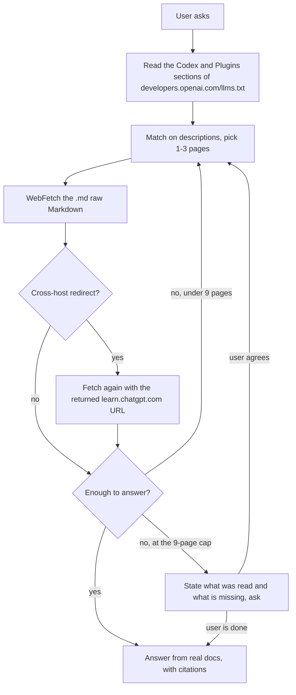

# Codex Docs Lookup Skill

This skill makes the agent read the current official OpenAI Codex documentation instead of
relying on what it memorized at training time. Codex's commands, config fields, sandbox,
skills, MCP, and permission model keep changing, so answering from memory goes wrong easily.
What this skill does is turn "look it up first, then answer" into a fixed procedure.

---

## 1. What problem it solves

Say you are writing an explanation of Codex CLI slash commands, or you hit an error configuring
MCP or the sandbox, or you want to know what a particular config field means. Those answers live
in the official docs, and the docs change. Answer from impression and the slug, field name, or
command shape you produce may already have been renamed.

The skill's job is narrow: for any question about Codex itself, find the matching page in the
official index, fetch its current content, and answer from that. It covers the Codex CLI
(install, slash commands, command-line options, configuration, sandboxing, authentication), the
IDE extension, the Codex app (automations, worktrees, computer use, the Chrome extension), Codex
cloud, and concepts and scenarios like subagents, skills, MCP, enterprise setup, and the
GitHub/Linear/Slack integrations.

One boundary matters: a question about the broader **OpenAI API or OpenAI SDK** rather than about
Codex the coding agent belongs under `developers.openai.com/api` and is out of scope here.

---

## 2. How to use it

Most of the time you do nothing. When your task depends on official Codex information, the skill
triggers and runs the lookup itself. You can pass a specific topic as an argument
(`slash commands`, `sandbox`), or pass nothing and let it infer the topic from the conversation.

Its answers land on real doc content, and it cites the doc title and URL when stating anything
non-obvious so you can check. What you get back is not a paraphrase blended with stale
knowledge — it is what the current official docs say.

In one line: if what you are doing depends on current official Codex information, this skill is
enough.

---

## 3. The underlying design, for maintainers

From here down is for whoever maintains this skill — what it is actually made of and why.

The core idea is lazy loading. It does not stuff a hundred-odd pages into the prompt; it depends
on a single entry point, the officially maintained index at
https://developers.openai.com/llms.txt. That index is a map of roughly 840 lines spanning
several OpenAI product lines, grouped as `## <Product line> — <Topic>`. Codex occupies the
`## Codex — ...` sections and plugin authoring occupies `## Plugins — ...`. Each line looks like:

```
- [Title](https://developers.openai.com/codex/<slug>.md): description
```

Note that each URL ends in `.md` — OpenAI publishes a Markdown twin for every page, so what
comes back is raw Markdown rather than rendered HTML, which is friendlier for an agent.

---

## 3.5. One migration, and the three traps it left behind

This section was added during the 2026-07-29 repair; it explains why the entry URL changed.

OpenAI moved the body of the Codex documentation to a new host, `learn.chatgpt.com/docs/`, and
set up a full set of 308 redirects on the old host. The migration itself is fine, but it left
three traps you have to know about.

**First, the old Codex-specific index is completely dead.**
`https://developers.openai.com/codex/llms.txt` gets rewritten by that blanket redirect rule to
`https://learn.chatgpt.com/docs/llms.txt`, and the new site has no such file — it returns 404.
`codex/llms-full.txt` behaves the same way. Worse, the developer hub's own root index still
carries a link to `codex/llms.txt` (line 16); following it is a dead end. The new host publishes
no `llms.txt` of its own either, only a `sitemap-index.xml` with no descriptions, which cannot
support triage-by-description.

**Second, the index that works is the level up, `https://developers.openai.com/llms.txt`.** The
entire Codex map was absorbed into this hub-level index. The format did not change; only the
grouping went from `## Section` to `## Codex — <Topic>`. Measured at the time, 132 of the 137
Codex pages listed there were reachable; the remaining 5 are stale entries OpenAI never cleaned
up (for example `codex/overview.md` and `codex/resources.md`). Hit one and pick a different
entry — do not repair the slug by hand.

**Third, fetching a body takes two hops.** For safety, `WebFetch` does not automatically follow
cross-host redirects; it returns the redirect target to the caller. So fetching a
`developers.openai.com/codex/<slug>.md` gives you `REDIRECT DETECTED` on the first call, and you
call again with the returned `learn.chatgpt.com/docs/<slug>.md`. That is normal flow, not an
error, and the two calls count as one page. Note also that old and new slugs are not a simple
host swap: `codex/skills.md` lands on `docs/build-skills.md`, and `codex/config-reference.md`
lands on `docs/config-file/config-reference.md`. So never assemble a new-host URL yourself — let
the redirect tell you.

Plugin-authoring pages are the exception: they live at
`https://developers.openai.com/plugins/<path>.md`, reachable directly with no redirect.

---

## 4. How the procedure is designed

Execution splits into several steps, and the heart of it is a small-batch, evaluate, loop
process rather than one exhaustive read.

**Step one, read the index.** It `WebFetch`es `https://developers.openai.com/llms.txt`, asking
for the raw Markdown of the two section families `## Codex —` and `## Plugins —`, preserving
every `- [Title](URL): description` line along with the section headers. This step is not
skippable, even when you think you remember the target URL, because doc slugs get renamed and the
index is the only trustworthy source of truth. There is a deliberate tradeoff here: this hub
index spans several OpenAI product lines, so it narrows at the product-line level (Codex and
Plugins only; OpenAI API, Ads, and Agentic Commerce are irrelevant to this skill) — but within
those two families it loads everything at once and searches across the whole map rather than
pre-filtering by topic again. The topic grouping is just page layout, not a reason to skip
entries, and a second round of filtering mostly succeeds at missing the answer that happened to
sit in the section you did not look at.

**Step two, pick pages.** It matches the user's question against each entry's description — the
part after the colon — not just the title. A few disciplines apply: one to three pages per batch,
since the index is for triage and not for bulk loading; one specific feature question maps to one
page; only a cross-concept question ("how do skills relate to subagents?") justifies several; and
if nothing in the index matches, say so and never guess a URL.

**Step three, fetch the batch.** One `WebFetch` per selected URL, with a prompt phrased as a
question that captures the user's real need rather than a generic "summarize this page". A
`developers.openai.com/codex/...` URL returns a cross-host redirect first; call again with the
returned `learn.chatgpt.com/docs/...` address, count the two as one page, and cite the new-host
URL that actually served the content.

**Step four, evaluate, then answer or loop.** This is the load-bearing step. After each batch,
judge whether the content answers the question. Enough — answer from what was fetched, with
citations. Not enough (the answer lives on another page, or a fetched page pointed elsewhere) —
go back to step two and pick the next one to three pages. The loop continues until it can answer,
with a default ceiling of nine pages total. At nine and still short, it stops, states honestly
what it has read and what is missing, and asks whether to continue — neither quietly blowing past
the cap nor filling the gap with guesses.



---

## 5. The reasoning behind the hard rules

Several rules look strict. Each maps to a real failure mode, so do not loosen them casually.

**No inventing doc URLs**, because the moment slug-guessing is allowed, the agent will confect a
plausible-looking wrong address whenever a page does not exist and send the user to a 404 or the
wrong content. Better to say "not in the index". This rule matters more since the migration: new
and old slugs do not map one to one, so an address you build by swapping the host is wrong nine
times out of ten. Follow the redirect instead.

**No skipping the index read**, because slugs get renamed and any address cached in the model
eventually goes bad. Only re-reading the index gives the currently valid mapping. The 2026
migration is the live example: even the address of the index file itself changed.

**Stay in scope**, to keep a clean boundary with the broader OpenAI API docs
(`developers.openai.com/api`) so the two do not contaminate each other's answers. Scope is now
defined by product line — the `## Codex —` and `## Plugins —` families in the hub index, on
whatever host currently serves them — rather than pinned to one URL prefix. That way the next
migration does not take the whole skill down.

**Pass the docs through rather than aggressively blending them with prior knowledge**, because
the user wants current authoritative behavior, not a synthesis laced with outdated assumptions.

**Small batches, a nine-page cap, and asking the user at the ceiling** exist to balance two
failure modes. Grabbing too much at once floods the context with irrelevance and dilutes the
signal; grabbing a single batch often is not enough for a hard question. Small batches make every
step carry an "is this enough?" judgment, the loop guarantees more gets fetched when it isn't, and
the cap prevents silently burning a large number of fetches on a question that cannot be answered.
Handing the choice back at the ceiling is deliberate: whether to keep digging is fundamentally the
user's call, and the skill should neither decide it silently nor paper over the gap with guesses.

Understanding these five sections is enough to see why the skill has one entry point, why it
insists on loading the index families whole, and why "look it up, then answer" is hardcoded as a
procedure. It is a small machine for converting official documentation into reusable agent
capability, and its reliability comes from always starting at the same trustworthy index.
